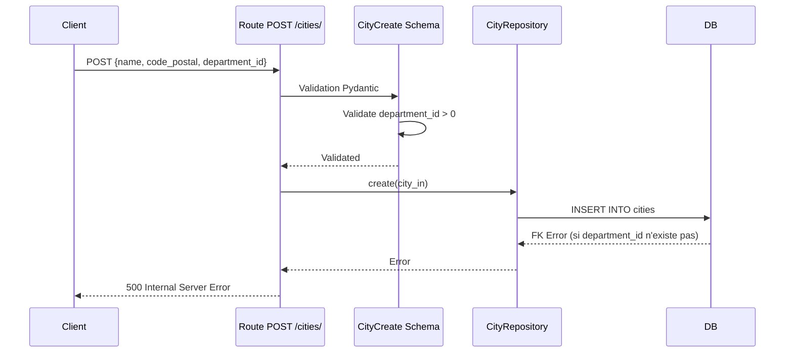
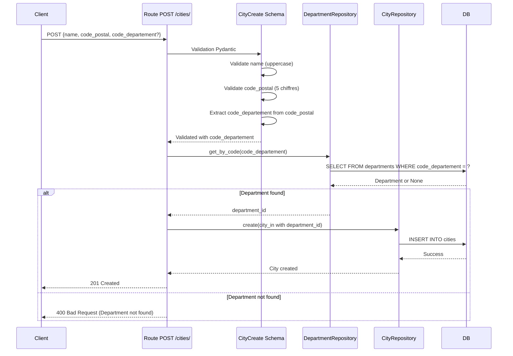

# Proposition d'amélioration de la création de villes (Cities)

## Résumé

Ce document propose une architecture et des changements précis pour améliorer la création de villes dans le projet FastAPI, en particulier pour automatiser l'association avec le département à partir du code postal.

## Problèmes identifiés

### 1. Aucune vérification d'existence du département

Le `department_id` est validé uniquement comme "positif" via [`validate_department_id()`](src/schemas/validators.py:53) mais **jamais vérifié** contre la base de données. Si l'ID n'existe pas → erreur de contrainte FK au niveau DB.

### 2. Méthode non utilisée

La méthode [`City.calculate_department_from_postal_code()`](src/model/city.py:70) existe mais n'est PAS utilisée. Cette méthode pourrait déduire automatiquement le département depuis le code postal.

### 3. Interface utilisateur non intuitive

L'utilisateur doit connaître l'ID numérique du département au lieu de pouvoir utiliser le code INSEE (ex: "75" pour Paris).

### 4. Aucune logique de récupération automatique

Il n'y a aucune logique pour :

- Récupérer le `department_id` à partir du `code_departement`
- Déduire le département depuis le code postal
- Créer automatiquement le département s'il n'existe pas

---

## Architecture proposée

### Flux de création de city (avant vs après)

#### Flux actuel



#### Flux proposé



---

## Changements proposés

### Fichier 1: [`src/schemas/city.py`](src/schemas/city.py)

#### Changements dans `CityCreate`

**Avant :**

```python
class CityCreate(BaseSchema):
    """Schéma de création pour City"""
    name: str
    code_postal: str
    department_id: int  # REQUIS
    latitude: Optional[float] = None
    longitude: Optional[float] = None

    @field_validator('name')
    @classmethod
    def uppercase_name(cls, v: str) -> str:
        """Convertit le nom en majuscules"""
        return uppercase_name(v)

    @field_validator('code_postal')
    @classmethod
    def validate_postal_code(cls, v: str) -> str:
        """Valide que le code postal est composé de 5 chiffres"""
        return validate_postal_code(v)

    @field_validator('department_id')
    @classmethod
    def validate_department_id(cls, v: int) -> int:
        """Valide que l'ID de département est positif"""
        return validate_department_id(v)
```

**Après :**

```python
class CityCreate(BaseSchema):
    """Schéma de création pour City"""
    name: str
    code_postal: str
    department_id: Optional[int] = None  # OPTIONNEL (déduit du code postal)
    code_departement: Optional[str] = None  # NOUVEAU: permet de spécifier explicitement
    latitude: Optional[float] = None
    longitude: Optional[float] = None

    @field_validator('name')
    @classmethod
    def uppercase_name(cls, v: str) -> str:
        """Convertit le nom en majuscules"""
        return uppercase_name(v)

    @field_validator('code_postal')
    @classmethod
    def validate_postal_code(cls, v: str) -> str:
        """Valide que le code postal est composé de 5 chiffres"""
        return validate_postal_code(v)

    @field_validator('code_departement')
    @classmethod
    def validate_code_departement(cls, v: Optional[str]) -> Optional[str]:
        """Valide le code département si présent"""
        return validate_code_departement_optional(v)

    @model_validator(mode='after')
    def derive_department_from_postal_code(self) -> 'CityCreate':
        """
        Dérive le code département depuis le code postal si non fourni explicitement.

        Le code_departement peut être fourni explicitement via le champ 'code_departement',
        ou déduit automatiquement depuis le code_postal.
        """
        from src.model.city import City

        # Si code_departement n'est pas fourni, le déduire du code_postal
        if self.code_departement is None:
            try:
                self.code_departement = City.calculate_department_from_postal_code(self.code_postal)
            except ValueError as e:
                raise ValueError(f"Impossible de déduire le code département depuis le code postal {self.code_postal}: {e}")

        return self

    @model_validator(mode='after')
    def validate_department_fields(self) -> 'CityCreate':
        """
        Valide que soit department_id soit code_departement est fourni,
        mais pas les deux en même temps.
        """
        if self.department_id is not None and self.code_departement is not None:
            raise ValueError("Ne fournissez pas à la fois 'department_id' et 'code_departement'")

        if self.department_id is None and self.code_departement is None:
            raise ValueError("Vous devez fournir soit 'department_id' soit 'code_departement'")

        return self
```

#### Changements dans `CityUpdate`

**Avant :**

```python
class CityUpdate(BaseSchema):
    """Schéma de mise à jour pour City"""
    name: Optional[str] = None
    code_postal: Optional[str] = None
    department_id: Optional[int] = None
    latitude: Optional[float] = None
    longitude: Optional[float] = None
```

**Après :**

```python
class CityUpdate(BaseSchema):
    """Schéma de mise à jour pour City"""
    name: Optional[str] = None
    code_postal: Optional[str] = None
    department_id: Optional[int] = None
    code_departement: Optional[str] = None  # NOUVEAU
    latitude: Optional[float] = None
    longitude: Optional[float] = None

    @field_validator('name')
    @classmethod
    def uppercase_name(cls, v: Optional[str]) -> Optional[str]:
        """Convertit le nom en majuscules si présent"""
        return uppercase_name_optional(v)

    @field_validator('code_postal')
    @classmethod
    def validate_postal_code(cls, v: Optional[str]) -> Optional[str]:
        """Valide que le code postal est composé de 5 chiffres si présent"""
        return validate_postal_code_optional(v)

    @field_validator('code_departement')
    @classmethod
    def validate_code_departement(cls, v: Optional[str]) -> Optional[str]:
        """Valide le code département si présent"""
        return validate_code_departement_optional(v)

    @model_validator(mode='after')
    def validate_department_fields(self) -> 'CityUpdate':
        """
        Valide que soit department_id soit code_departement est fourni,
        mais pas les deux en même temps.
        """
        if self.department_id is not None and self.code_departement is not None:
            raise ValueError("Ne fournissez pas à la fois 'department_id' et 'code_departement'")
        return self
```

---

### Fichier 2: [`src/routes/cities.py`](src/routes/cities.py)

#### Changements dans la route `POST /cities/`

**Avant :**

```python
from fastapi import APIRouter, Depends, HTTPException, status
from typing import List

from src.schemas.city import CityCreate, CityUpdate, CityRead
from src.dependencies import CityRepoDep

# Création du routeur avec un préfixe et des tags
router = APIRouter(prefix="/cities", tags=["cities"])


@router.post(
    "/",
    response_model=CityRead,
    status_code=status.HTTP_201_CREATED,
    summary="Créer une nouvelle commune",
    description="Crée une nouvelle commune avec le nom, le code postal et l'ID de département spécifiés. Le nom est automatiquement converti en majuscules."
)
def create_city(
    city_in: CityCreate,
    repo: CityRepoDep
) -> CityRead:
    """
    Crée une nouvelle commune.

    Args:
        city_in: Données de la commune à créer
        repo: Repository CityRepository (injecté par dépendance)

    Returns:
        La commune créée

    Raises:
        HTTPException: Si une erreur survient lors de la création
    """
    model = repo.create(city_in)
    return CityRead.model_validate(model)
```

**Après :**

```python
from fastapi import APIRouter, Depends, HTTPException, status
from typing import List

from src.schemas.city import CityCreate, CityUpdate, CityRead
from src.dependencies import CityRepoDep, DepartmentRepoDep
from src.model.city import City

# Création du routeur avec un préfixe et des tags
router = APIRouter(prefix="/cities", tags=["cities"])


@router.post(
    "/",
    response_model=CityRead,
    status_code=status.HTTP_201_CREATED,
    summary="Créer une nouvelle commune",
    description=(
        "Crée une nouvelle commune avec le nom et le code postal. "
        "Le département peut être spécifié soit par son ID (department_id), "
        "soit par son code INSEE (code_departement, ex: '75' pour Paris). "
        "Si aucun n'est fourni, le code département est déduit automatiquement depuis le code postal. "
        "Le nom est automatiquement converti en majuscules."
    )
)
def create_city(
    city_in: CityCreate,
    city_repo: CityRepoDep,
    department_repo: DepartmentRepoDep
) -> CityRead:
    """
    Crée une nouvelle commune.

    Le département est déterminé selon la priorité suivante :
    1. Si department_id est fourni, il est utilisé directement
    2. Si code_departement est fourni, il est recherché dans la BDD
    3. Sinon, le code_departement est déduit du code_postal et recherché

    Args:
        city_in: Données de la commune à créer
        city_repo: Repository CityRepository (injecté par dépendance)
        department_repo: Repository DepartmentRepository (injecté par dépendance)

    Returns:
        La commune créée

    Raises:
        HTTPException: Si le département n'existe pas (404)
    """
    # Si department_id n'est pas fourni, le récupérer depuis code_departement
    if city_in.department_id is None:
        # Le code_departement est déjà déduit dans le schéma via model_validator
        department = department_repo.get_by_code(city_in.code_departement)

        if not department:
            raise HTTPException(
                status_code=status.HTTP_404_NOT_FOUND,
                detail=f"Département avec le code '{city_in.code_departement}' non trouvé. "
                       f"Veuillez créer ce département d'abord ou vérifier le code postal."
            )

        city_in.department_id = department.id

    model = city_repo.create(city_in)
    return CityRead.model_validate(model)
```

#### Changements dans la route `POST /cities/upsert`

**Avant :**

```python
@router.post(
    "/upsert",
    response_model=CityRead,
    summary="Créer ou mettre à jour une commune (upsert)",
    description="Récupère une commune existante par son nom et code postal, ou la crée si elle n'existe pas."
)
def upsert_city(
    city_in: CityCreate,
    repo: CityRepoDep
) -> CityRead:
    """
    Crée ou met à jour une commune (upsert).

    Args:
        city_in: Données de la commune
        repo: Repository CityRepository (injecté par dépendance)

    Returns:
        La commune existante ou nouvellement créée
    """
    model = repo.get_or_create(city_in)
    return CityRead.model_validate(model)
```

**Après :**

```python
@router.post(
    "/upsert",
    response_model=CityRead,
    summary="Créer ou mettre à jour une commune (upsert)",
    description=(
        "Récupère une commune existante par son nom et code postal, ou la crée si elle n'existe pas. "
        "Le département peut être spécifié soit par son ID (department_id), "
        "soit par son code INSEE (code_departement, ex: '75' pour Paris). "
        "Si aucun n'est fourni, le code département est déduit automatiquement depuis le code postal."
    )
)
def upsert_city(
    city_in: CityCreate,
    city_repo: CityRepoDep,
    department_repo: DepartmentRepoDep
) -> CityRead:
    """
    Crée ou met à jour une commune (upsert).

    Args:
        city_in: Données de la commune
        city_repo: Repository CityRepository (injecté par dépendance)
        department_repo: Repository DepartmentRepository (injecté par dépendance)

    Returns:
        La commune existante ou nouvellement créée

    Raises:
        HTTPException: Si le département n'existe pas (404)
    """
    # Si department_id n'est pas fourni, le récupérer depuis code_departement
    if city_in.department_id is None:
        department = department_repo.get_by_code(city_in.code_departement)

        if not department:
            raise HTTPException(
                status_code=status.HTTP_404_NOT_FOUND,
                detail=f"Département avec le code '{city_in.code_departement}' non trouvé. "
                       f"Veuillez créer ce département d'abord ou vérifier le code postal."
            )

        city_in.department_id = department.id

    model = city_repo.get_or_create(city_in)
    return CityRead.model_validate(model)
```

#### Changements dans la route `POST /cities/bulk`

**Avant :**

```python
@router.post(
    "/bulk",
    response_model=List[CityRead],
    status_code=status.HTTP_201_CREATED,
    summary="Créer plusieurs communes en une seule requête",
    description="Crée plusieurs communes en une seule requête pour optimiser les performances."
)
def bulk_create_cities(
    cities_in: List[CityCreate],
    repo: CityRepoDep
) -> List[CityRead]:
    """
    Crée plusieurs communes en une seule requête.

    Args:
        cities_in: Liste des données de communes à créer
        repo: Repository CityRepository (injecté par dépendance)

    Returns:
        Liste des communes créées
    """
    models = repo.bulk_create(cities_in)
    return [CityRead.model_validate(m) for m in models]
```

**Après :**

```python
@router.post(
    "/bulk",
    response_model=List[CityRead],
    status_code=status.HTTP_201_CREATED,
    summary="Créer plusieurs communes en une seule requête",
    description=(
        "Crée plusieurs communes en une seule requête pour optimiser les performances. "
        "Pour chaque ville, le département peut être spécifié soit par son ID (department_id), "
        "soit par son code INSEE (code_departement, ex: '75' pour Paris). "
        "Si aucun n'est fourni, le code département est déduit automatiquement depuis le code postal."
    )
)
def bulk_create_cities(
    cities_in: List[CityCreate],
    city_repo: CityRepoDep,
    department_repo: DepartmentRepoDep
) -> List[CityRead]:
    """
    Crée plusieurs communes en une seule requête.

    Args:
        cities_in: Liste des données de communes à créer
        city_repo: Repository CityRepository (injecté par dépendance)
        department_repo: Repository DepartmentRepository (injecté par dépendance)

    Returns:
        Liste des communes créées

    Raises:
        HTTPException: Si un département n'existe pas (404)
    """
    # Préparer un cache des départements pour éviter les requêtes répétées
    department_cache: dict[str, int] = {}

    for city_in in cities_in:
        if city_in.department_id is None:
            code_dept = city_in.code_departement

            # Vérifier le cache
            if code_dept not in department_cache:
                department = department_repo.get_by_code(code_dept)
                if not department:
                    raise HTTPException(
                        status_code=status.HTTP_404_NOT_FOUND,
                        detail=f"Département avec le code '{code_dept}' non trouvé."
                    )
                department_cache[code_dept] = department.id

            city_in.department_id = department_cache[code_dept]

    models = city_repo.bulk_create(cities_in)
    return [CityRead.model_validate(m) for m in models]
```

#### Changements dans la route `PUT /cities/{city_id}`

**Avant :**

```python
@router.put(
    "/{city_id}",
    response_model=CityRead,
    summary="Mettre à jour une commune",
    description="Met à jour les informations d'une commune existante. Le nom est automatiquement converti en majuscules."
)
def update_city(
    city_id: int,
    city_in: CityUpdate,
    repo: CityRepoDep
) -> CityRead:
    """
    Met à jour une commune.

    Args:
        city_id: Identifiant de la commune à mettre à jour
        city_in: Données de mise à jour
        repo: Repository CityRepository (injecté par dépendance)

    Returns:
        La commune mise à jour

    Raises:
        HTTPException: Si la commune n'existe pas (404)
    """
    model = repo.get(city_id)
    if not model:
        raise HTTPException(
            status_code=status.HTTP_404_NOT_FOUND,
            detail=f"Commune avec l'ID {city_id} non trouvée"
        )
    updated = repo.update(model, city_in)
    return CityRead.model_validate(updated)
```

**Après :**

```python
@router.put(
    "/{city_id}",
    response_model=CityRead,
    summary="Mettre à jour une commune",
    description=(
        "Met à jour les informations d'une commune existante. "
        "Le nom est automatiquement converti en majuscules. "
        "Le département peut être modifié soit par son ID (department_id), "
        "soit par son code INSEE (code_departement, ex: '75' pour Paris)."
    )
)
def update_city(
    city_id: int,
    city_in: CityUpdate,
    city_repo: CityRepoDep,
    department_repo: DepartmentRepoDep
) -> CityRead:
    """
    Met à jour une commune.

    Args:
        city_id: Identifiant de la commune à mettre à jour
        city_in: Données de mise à jour
        city_repo: Repository CityRepository (injecté par dépendance)
        department_repo: Repository DepartmentRepository (injecté par dépendance)

    Returns:
        La commune mise à jour

    Raises:
        HTTPException: Si la commune n'existe pas (404) ou si le département n'existe pas (404)
    """
    model = city_repo.get(city_id)
    if not model:
        raise HTTPException(
            status_code=status.HTTP_404_NOT_FOUND,
            detail=f"Commune avec l'ID {city_id} non trouvée"
        )

    # Si code_departement est fourni, le convertir en department_id
    if city_in.code_departement is not None:
        department = department_repo.get_by_code(city_in.code_departement)
        if not department:
            raise HTTPException(
                status_code=status.HTTP_404_NOT_FOUND,
                detail=f"Département avec le code '{city_in.code_departement}' non trouvé."
            )
        city_in.department_id = department.id

    updated = city_repo.update(model, city_in)
    return CityRead.model_validate(updated)
```

---

### Fichier 3: [`src/schemas/validators.py`](src/schemas/validators.py)

Aucun changement requis. Les validateurs existants [`validate_code_departement()`](src/schemas/validators.py:67) et [`validate_code_departement_optional()`](src/schemas/validators.py:82) sont déjà disponibles.

---

### Fichier 4: [`src/dependencies.py`](src/dependencies.py)

Aucun changement requis. La dépendance `DepartmentRepoDep` existe déjà :

```python
DepartmentRepoDep = Annotated[DepartmentRepository, Depends(get_department_repository)]
```

---

### Fichier 5: [`src/schemas/__init__.py`](src/schemas/__init__.py)

Vérifier que les importations sont correctes. Aucun changement requis si `validate_code_departement_optional` est déjà exporté.

---

## Nouveaux exemples d'utilisation

### Exemple 1: Création avec code postal (déduction automatique)

**Requête :**

```bash
POST /cities/
Content-Type: application/json

{
    "name": "Paris",
    "code_postal": "75001"
}
```

**Comportement :**

1. Le nom est converti en majuscules : "PARIS"
2. Le code département est déduit du code postal : "75"
3. Le département "75" est recherché en BDD
4. Si trouvé, la ville est créée avec le `department_id` correspondant

**Réponse (succès) :**

```json
{
  "id": 1,
  "name": "PARIS",
  "code_postal": "75001",
  "department_id": 12,
  "latitude": null,
  "longitude": null,
  "created_at": "2026-02-11T10:00:00Z",
  "updated_at": "2026-02-11T10:00:00Z"
}
```

**Réponse (erreur) :**

```json
{
  "detail": "Département avec le code '75' non trouvé. Veuillez créer ce département d'abord ou vérifier le code postal."
}
```

### Exemple 2: Création avec code_departement explicite

**Requête :**

```bash
POST /cities/
Content-Type: application/json

{
    "name": "Marseille",
    "code_postal": "13001",
    "code_departement": "13"
}
```

**Comportement :**

1. Le nom est converti en majuscules : "MARSEILLE"
2. Le code département "13" est utilisé directement
3. Le département "13" est recherché en BDD
4. Si trouvé, la ville est créée

### Exemple 3: Création avec department_id explicite (compatibilité arrière)

**Requête :**

```bash
POST /cities/
Content-Type: application/json

{
    "name": "Lyon",
    "code_postal": "69001",
    "department_id": 42
}
```

**Comportement :**

1. Le nom est converti en majuscules : "LYON"
2. Le `department_id` 42 est utilisé directement
3. Aucune vérification en BDD (comportement actuel)
4. La ville est créée

### Exemple 4: Erreur - department_id et code_departement fournis

**Requête :**

```bash
POST /cities/
Content-Type: application/json

{
    "name": "Bordeaux",
    "code_postal": "33000",
    "department_id": 33,
    "code_departement": "33"
}
```

**Réponse :**

```json
{
  "detail": "Ne fournissez pas à la fois 'department_id' et 'code_departement'"
}
```

### Exemple 5: Erreur - Aucun champ de département fourni

**Requête :**

```bash
POST /cities/
Content-Type: application/json

{
    "name": "Nice",
    "code_postal": "06000"
}
```

**Réponse :**

```json
{
  "detail": "Vous devez fournir soit 'department_id' soit 'code_departement'"
}
```

---

## Avantages de cette solution

### 1. **Expérience utilisateur améliorée**

- L'utilisateur n'a plus besoin de connaître l'ID numérique du département
- Il peut utiliser le code INSEE familier (ex: "75" pour Paris)
- La déduction automatique depuis le code postal simplifie encore plus l'usage

### 2. **Validation explicite**

- Les erreurs de FK sont détectées au niveau de l'API (404) plutôt qu'au niveau de la BDD (500)
- Les messages d'erreur sont clairs et exploitables

### 3. **Réutilisation du code existant**

- La méthode [`City.calculate_department_from_postal_code()`](src/model/city.py:70) est enfin utilisée
- Le repository [`DepartmentRepository.get_by_code()`](src/repository/department.py:20) est intégré

### 4. **Flexibilité**

- Trois modes de spécification du département :
  1. `department_id` (compatibilité arrière)
  2. `code_departement` (nouveau, plus intuitif)
  3. Déduction automatique depuis `code_postal` (nouveau, plus simple)

### 5. **Performance**

- Pour le bulk create, un cache des départements évite les requêtes répétées

### 6. **Sécurité**

- Validation stricte : soit `department_id`, soit `code_departement`, mais pas les deux
- Le modèle de données n'est pas modifié (pas de migration nécessaire)

---

## Risques potentiels et mitigation

### 1. **Risque: Rétrocompatibilité**

**Description :** Les clients existants qui utilisent `department_id` pourraient être affectés si le comportement change.

**Mitigation :**

- Le champ `department_id` reste optionnel et fonctionnel
- Si `department_id` est fourni, il est utilisé directement (comportement identique)
- Aucun changement cassant n'est introduit

### 2. **Risque: Performance**

**Description :** Ajout d'une requête supplémentaire pour chaque création de ville.

**Mitigation :**

- Pour le bulk create, un cache minimise les requêtes
- La requête `get_by_code` utilise un index sur `code_departement` (à vérifier)
- Optionnel : Ajouter un index sur `departments.code_departement` si inexistant

### 3. **Risque: Code postal invalide**

**Description :** Si le code postal est invalide, la déduction échoue.

**Mitigation :**

- Le validateur `validate_postal_code` garantit un format correct
- L'erreur est clairement indiquée à l'utilisateur

### 4. **Risque: Département inexistant**

**Description :** Le département déduit n'existe pas en BDD.

**Mitigation :**

- Erreur HTTP 404 avec message explicite
- L'utilisateur est guidé pour créer le département d'abord

### 5. **Risque: Cas particuliers mal gérés**

**Description :** La Corse (2A/2B) ou les DOM-TOM pourraient poser problème.

**Mitigation :**

- La méthode [`City.calculate_department_from_postal_code()`](src/model/city.py:70) gère déjà ces cas
- Tests unitaires à ajouter pour ces cas particuliers

---

## Tests recommandés

### Tests unitaires

1. **Test de déduction du code département depuis le code postal**
   - Cas normal : "75001" → "75"
   - Corse-du-Sud : "20000" → "2A"
   - Haute-Corse : "20200" → "2B"
   - DOM : "97100" → "971"

2. **Test du validateur `validate_department_fields`**
   - Erreur si `department_id` et `code_departement` fournis
   - Erreur si aucun champ fourni

3. **Test du validateur `derive_department_from_postal_code`**
   - Déduction automatique si `code_departement` non fourni
   - Conservation de `code_departement` si fourni explicitement

### Tests d'intégration

1. **Test de création avec déduction automatique**
   - Vérifier que le `department_id` est correctement assigné

2. **Test de création avec `code_departement` explicite**
   - Vérifier que le bon département est associé

3. **Test d'erreur si département inexistant**
   - Vérifier le code HTTP 404 et le message d'erreur

4. **Test de bulk create**
   - Vérifier que le cache fonctionne (pas de requêtes répétées)

5. **Test de compatibilité arrière**
   - Vérifier que les requêtes avec `department_id` fonctionnent encore

---

## Résumé des fichiers à modifier

| Fichier                                                        | Type de modification                                 | Priorité |
| -------------------------------------------------------------- | ---------------------------------------------------- | -------- |
| [`src/schemas/city.py`](src/schemas/city.py)                   | Ajout de champs et validateurs                       | Haute    |
| [`src/routes/cities.py`](src/routes/cities.py)                 | Injection de DepartmentRepoDep et logique de mapping | Haute    |
| [`src/schemas/validators.py`](src/schemas/validators.py)       | Aucun changement requis                              | -        |
| [`src/dependencies.py`](src/dependencies.py)                   | Aucun changement requis                              | -        |
| [`src/repository/department.py`](src/repository/department.py) | Aucun changement requis                              | -        |

---

## Conclusion

Cette proposition améliore significativement l'expérience utilisateur pour la création de villes en :

1. **Automatisant** l'association département depuis le code postal
2. **Permettant** l'utilisation du code INSEE familier
3. **Validant** explicitement l'existence du département
4. **Maintenant** la rétrocompatibilité avec le code existant

Les changements sont localisés, bien structurés et peuvent être implémentés sans migration de base de données.
