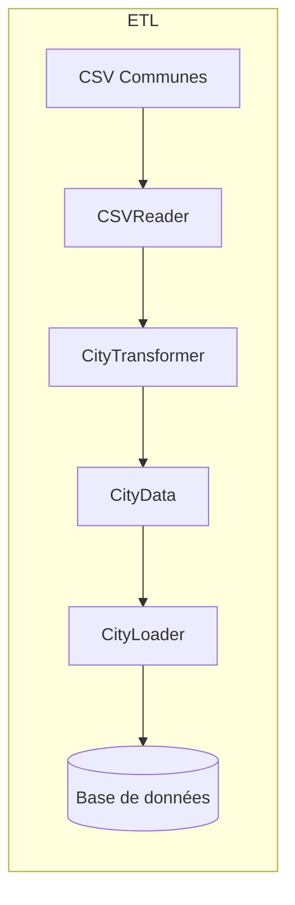

# Architecture de l'ETL pour l'ingestion des communes

## 1. Vue d'ensemble

L'ETL principal pour l'ingestion des communes permet de consommer un fichier CSV, d'extraire les communes (nom + code postal), de les transformer (uppercase, validation, mapping département) et de les enregistrer en base de données via le serveur.

## 2. Responsabilités

### ETL

- Extraction du fichier CSV
- Transformation (normalisation nom en uppercase, validation code postal)
- Extraction des coordonnées GPS
- Mapping département (résolution department_id depuis code_postal)
- Gestion des doublons
- Appel au serveur pour sauvegarde

### Serveur

- Validation des données via Pydantic
- Déduplication (contrainte d'unicité name + code_postal)
- Déduction automatique du département depuis le code postal
- Recherche du département en base
- Persistence en base de données
- Gestion transactionnelle

## 3. Composants à créer

| Composant       | Fichier                                  | Description                         |
| --------------- | ---------------------------------------- | ----------------------------------- |
| CityData        | src/etl/utils/data_models.py             | Modèle de données intermédiaire     |
| CityTransformer | src/etl/transformers/city_transformer.py | Transformer pour les communes       |
| BaseLoader      | src/etl/loaders/base_loader.py           | Classe abstraite pour les loaders   |
| CityLoader      | src/etl/loaders/city_loader.py           | Loader pour les communes            |
| CityETLPipeline | src/etl/scripts/city_etl_pipeline.py     | Script principal du pipeline        |
| get_etl_db()    | src/database.py                          | Fonction pour les sessions DB ETL   |
| get_by_codes()  | src/repository/department.py             | Méthode additionnelle au repository |

## 4. Flux de données



## 5. Étapes du pipeline

1. **Extraction CSV** : Lecture itérative du fichier data/csv/communes_departements.csv
2. **Transformation** : Normalisation nom, validation code postal, extraction GPS
3. **Mapping département** : Résolution groupée des department_id depuis les codes postaux
4. **Préparation** : Identification et marquage des doublons potentiels
5. **Chargement** : Insertion en base via bulk_create() du repository
6. **Gestion doublons** : Séparation des nouvelles communes des doublons existants

## 6. Spécifications des composants

### 6.1 CityData

```python
@dataclass
class CityData:
    name: str
    code_postal: str
    department_name: Optional[str] = None
    latitude: Optional[float] = None
    longitude: Optional[float] = None
```

### 6.2 CityTransformer

- Hérite de BaseTransformer[CityData]
- Extrait les communes uniques (basé sur nom + code_postal)
- Normalise les noms en uppercase
- Extrait les coordonnées GPS si disponibles
- Normalise les codes postaux (padding avec zéro à gauche)

### 6.3 BaseLoader

- Classe abstraite héritant de BaseETLComponent
- Méthode abstraite load() à implémenter par les sous-classes

### 6.4 CityLoader

- Hérite de BaseLoader[CityData]
- Résout les department_id depuis les codes postaux
- Utilise CityRepository.bulk_create() pour l'insertion en lot
- Gère les doublons et les erreurs de département manquant

### 6.5 CityETLPipeline

- Script principal orchestrant le pipeline complet
- Étapes: Extract → Transform → Load
- Exécutable via python3 -m src.etl.scripts.city_etl_pipeline
